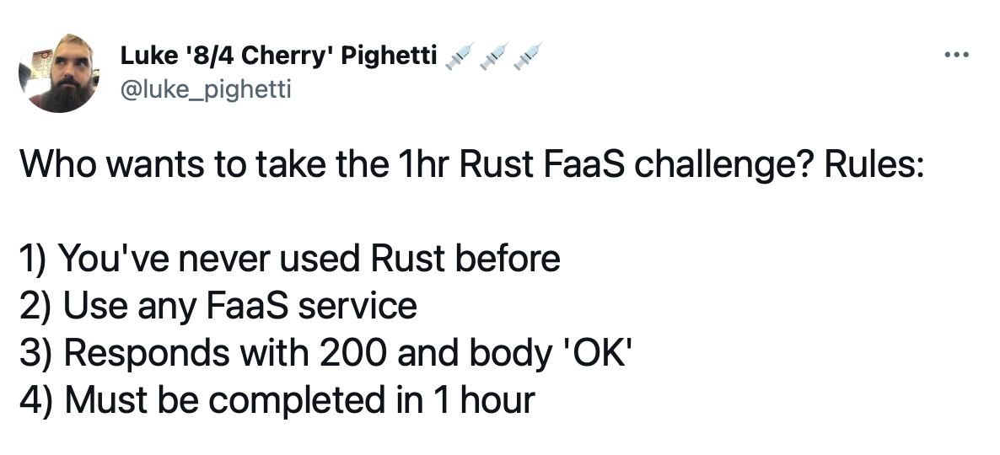

# Rust FaaS Challenge

It's common for software engineers to be asked to do small to medium sized lifts with technologies they have never touched before. The Rust FaaS Challenge can be done with any modern language that has a known server component that you've never touched before. I recommend that everyone try these timeboxed challenges to build confidence outside your areas of specialization.

## YouTube

https://www.youtube.com/watch?v=p5ktvLLxQqA

## Server

https://hello-7lflychdea-uc.a.run.app